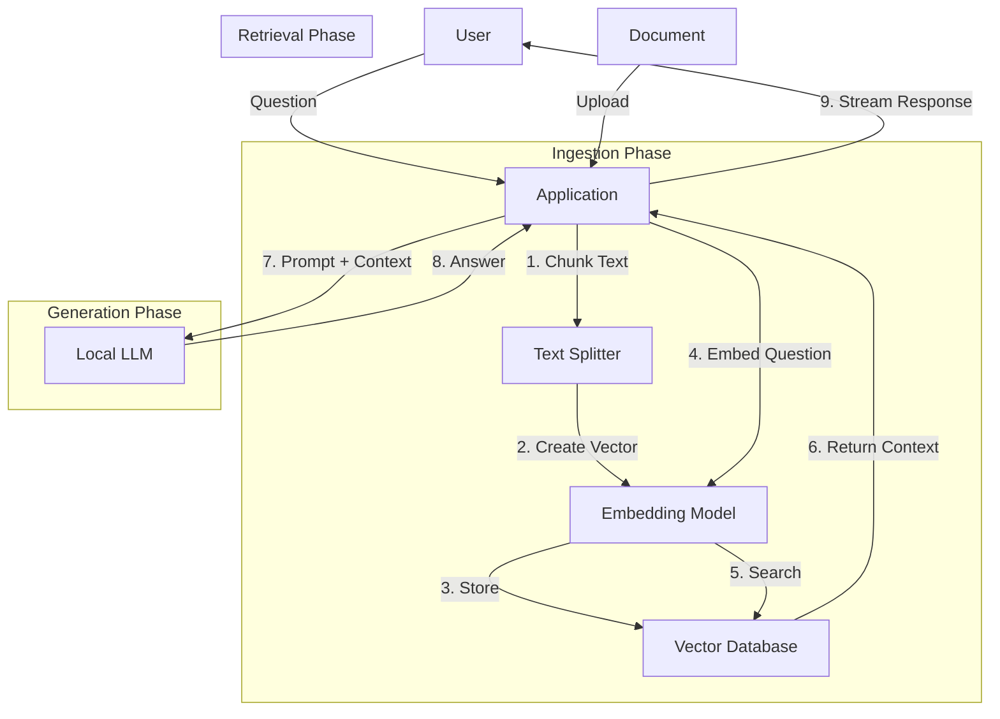

# Understanding the RAG Architecture

Retrieval-Augmented Generation (RAG) is the bridge between your static documents and the LLM's reasoning capabilities. Here is the step-by-step flow of what happens in the RAG layer.

## The High-Level Flow



## 1. Ingestion Phase (When you upload a file)
Before we can ask questions, we must prepare the knowledge base.

1.  **Chunking**: The document is quite large (e.g., 50 pages). We split it into smaller pieces, or "chunks" (e.g., 500 words each).
    *   *Why?* LLMs have a limit on how much text they can read at once. Small chunks are also more precise for searching.
2.  **Embedding**: We pass each chunk through an **Embedding Model** (sentence-transformers).
    *   *What is it?* This model converts text into a list of numbers (a vector) representing its *meaning*.
    *   *Example*: "The cat sat on the mat" -> `[0.1, -0.5, 0.8, ...]`
3.  **Storage**: We save the text chunk AND its vector into the **Vector Database** (ChromaDB).

## 2. Retrieval Phase (When you ask a question)
Now the user asks: *"What is the invoice total?"*

1.  **Embed Question**: We verify the question using the *same* embedding model.
    *   "What is the invoice total?" -> `[0.2, -0.4, 0.9, ...]`
2.  **Vector Search**: We ask ChromaDB: *"Find the chunks that are mathematically closest to this question's vector."*
    *   It finds the chunk containing: *"The total amount due is $500.00"* because their meanings ( vectors) are similar.
3.  **Context Return**: ChromaDB gives back the top 3-5 most relevant text chunks.

## 3. Generation Phase (The LLM Answer)
We now have the user's question AND the answer key (the relevant chunks).

1.  **Prompt Construction**: The application builds a prompt for the LLM:
    ```text
    System: You are a helpful assistant. Use the context below to answer the question.
    
    Context:
    - "The total amount due is $500.00"
    - "Payment is due by Jan 30th."
    
    User Question: "What is the invoice total?"
    ```
2.  **LLM Inference**: The Local LLM (Ollama) reads this prompt. It doesn't need to have memorized your invoice; it just reads the context we provided.
3.  **Answer Generation**: The LLM says: *"The invoice total is $500.00."*
4.  **Streaming**: The application streams this answer back to the UI in real-time.

## Component Responsibilities

*   **Application (FastAPI)**: The traffic controller. It manages the websocket, calls the RAG engine, and formats the response.
*   **Vector DB (ChromaDB)**: The smart filing cabinet. It organizes information by *meaning*, not just keywords.
*   **Embedding Model**: The translator. Converts human language into machine-understandable vectors.
*   **Local LLM (Ollama)**: The reasoner. It takes the retrieved facts and formulates a coherent, human-like answer.
